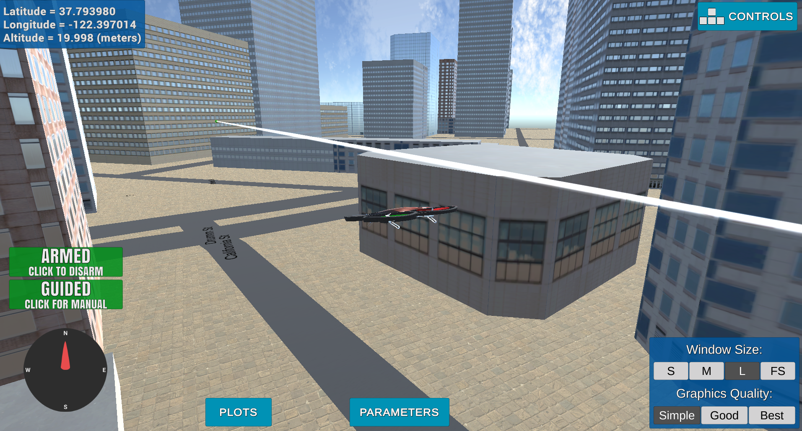

## Project: 3D Motion Planning

---

# Required Steps for a Passing Submission:
1. Load the 2.5D map in the colliders.csv file describing the environment.
2. Discretize the environment into a grid or graph representation.
3. Define the start and goal locations.
4. Perform a search using A* or other search algorithm.
5. Use a collinearity test or ray tracing method (like Bresenham) to remove unnecessary waypoints.
6. Return waypoints in local ECEF coordinates (format for `self.all_waypoints` is [N, E, altitude, heading], where the drone’s start location corresponds to [0, 0, 0, 0].
7. Write it up.
8. Congratulations!  Your Done!

## What's implemented:
### Here I will explain what this project does and how I implemented it.   

---
### Writeup / README

#### This is a Writeup / README that includes how I addressed this planning project:

### The Starter Code

#### 1.  Functionality in `motion_planning.py` and `planning_utils.py`:
These scripts contain a basic planning implementation that includes:
 - The drone States Class which inherits from python's Enum class and are set to auto( )
 - The MotionPlanning Class which inherits from the Drone class in Udacidrone API. All the drone implementation lie in this class
 - Within the MotionPlanning you will find the following:
    - The register callbacks
    - Methods to define the drone's local_position, velocity, state, all transition states and the plan_path method
 - The `plan_path()` is the main method here that reads the obstacle points from `colliders.csv' and sets the home position of the drone
 - It also creates the grid by calling the `create_grid` method in `planning_utils.py`
 - After creating the grid, we call the `a_star()` method to search for the most optimal path to the goal
 - Finally we `prune_path()` and send the waypoints to the drone to execute
 
And here's an awesome image of the drone excuting on the developed plan to California St and Drum St intersection: 

### How I implemented the Path Planning Algorithm

#### 1. Set the global home position
- Read the first line of the csv file, extract lat0 and lon0 as floating point values
- Used the self.set_home_position() method from [UdacidroneAPI](https://github.com/udacity/udacidrone/tree/master/udacidrone) to set global home
    - `self.set_home_position(lon0, lat0, 0)`

And here is a lovely picture of our downtown San Francisco environment from above!

#### 2. Set current local position
- Converted to current local position using `global_to_local()`
    - `current_local_pos = global_to_local(self.global_position, self.global_home)`

#### 3. Set grid start position from local position
In here, we want to add flexibility to the start location so that the drone treats the current location at the code start as the start location. This avoids the drone from having to move all the way to the center of the map every time we run the code.

` grid_start = (int(current_local_pos[0]-north_offset), int(current_local_pos[1]-east_offset))`

#### 4. Set grid goal position from geodetic coords
Now, we need to add flexibility to the desired goal location as well. Users should be able to choose any (lat, lon) from the map (or simulator) within the map and have it rendered to a goal location on the grid.

For example, I chose the intersection of California st and Drum st to be my goal. Here is how the code would look like: 

`drum_california = global_to_local([-122.396478, 37.793969, 0], self.global_home)`

To get your own goal coordinates, run the simulator and manually move the drone to any point on the map. Then copy the lon and lat from the blue box on the top left of the screen. There you go. Now you have a dynamic start and end goal for your plan. Great job!

#### 5. Modify A* to include diagonal motion (or replace A* altogether)
Now that you have a start and end points, a plan and a set of actions. You can improve on the defined actions by adding diagonal motions in the A* implementation in `planning_utils()` with a cost of sqrt(2).

Here is how to do that:
- first, you need to add the diagonal directions in `Class Action(Enum)` with cost `np.sqrt(2)`
- Then, define the diagonal actions in `valid_actions()`
- Finally, update the A* method to get the new vertexes connected to the current vertex

#### 6. Cull waypoints 
- For the last step, you need to do some pruning to your path to minimize the waypoints defined in the plan 
- The way I did that is by using `collinearity` test to find all the points that lie on the same line (i.e triangle area = 0) 
- Finally, I created `prun_plan()` method to remove all points on the same line to provide a smooth ride for the drone and prune the path of unnecessary waypoints

### Execute the flight
#### 1. Does it work?
## YAAY! It works!
