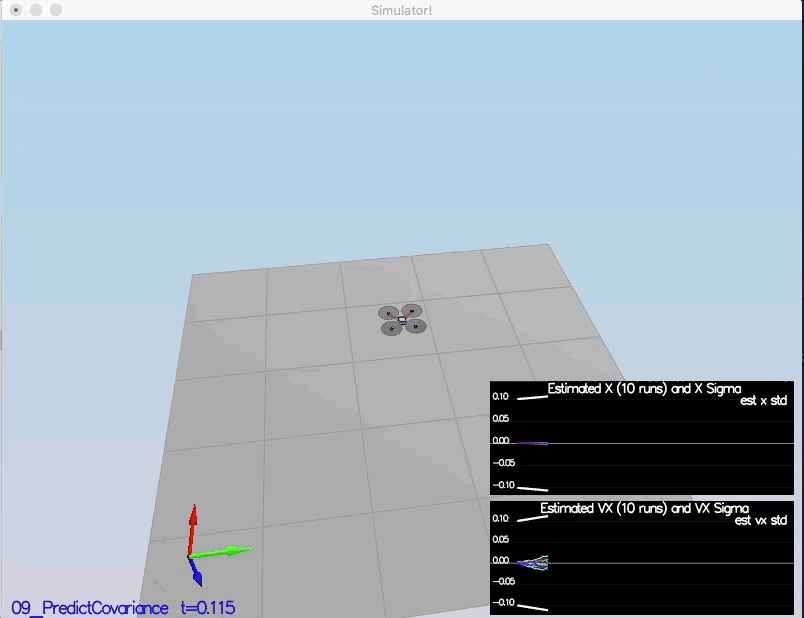

# Estimation Project Writeup #

### Scenario 6: Sensor Noise ###

#### Completed ####
```
Simulation #8 (../config/06_SensorNoise.txt)
PASS: ABS(Quad.GPS.X-Quad.Pos.X) was less than MeasuredStdDev_GPSPosXY for 68% of the time
PASS: ABS(Quad.IMU.AX-0.000000) was less than MeasuredStdDev_AccelXY for 69% of the time
```


### Scenario 7: Attitude Estimation ###

#### Completed ####

```
Simulation #13 (../config/07_AttitudeEstimation.txt)
PASS: ABS(Quad.Est.E.MaxEuler) was less than 0.100000 for at least 3.000000 seconds
```


### Scenario 8: Prediction Step ###

#### Completed ####


### Scenario 9 ###

#### Completed ####


